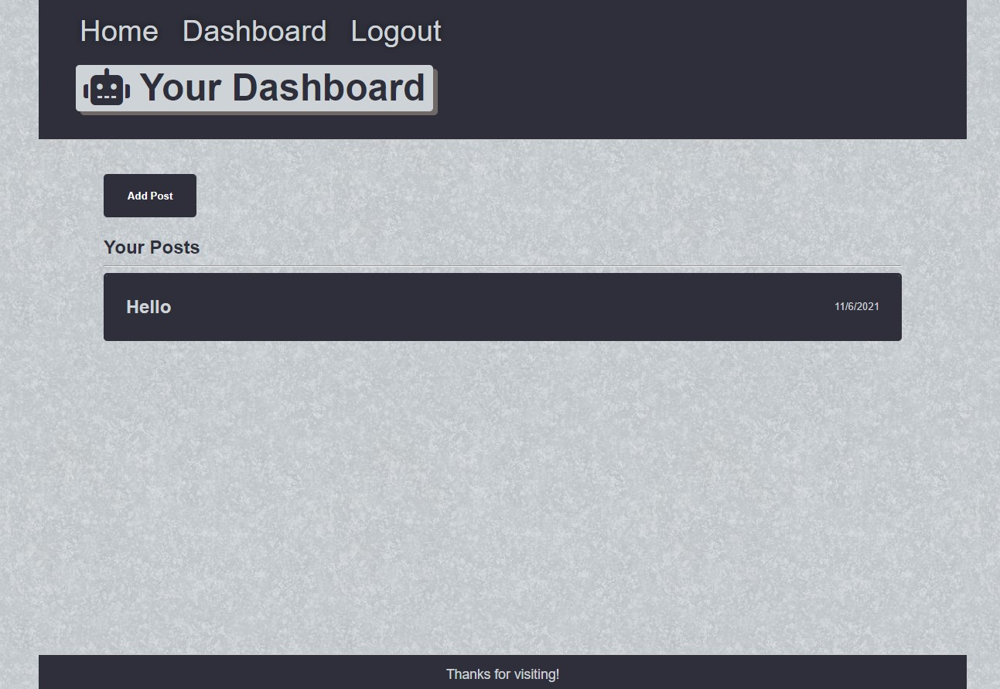

# CMS-Blog
A blog site similar to a Wordpress site, where developers can publish their blog posts and comment on other developers' posts as well. 

# Installation
Clone the repository from Github and open using Visual Studio Code.

# Usage
[Deployed Site](https://floating-lowlands-68212.herokuapp.com/)

# Credits 
Made by [Shannon Dukes]

[express.js](https://www.npmjs.com/package/express)

[express-session](https://www.npmjs.com/package/express-session)

[connect-session-sequelize](https://www.npmjs.com/package/connect-session-sequelize)

[MySQL 2](https://www.npmjs.com/package/mysql2)

[handlebars](https://handlebarsjs.com/)

[Sequelize](https://www.npmjs.com/package/sequelize)

[dotenv](https://www.npmjs.com/package/dotenv)

# Questions
[Contact Me](mrs.knit.wit.dukes@gmail.com)

[GitHub](https://github.com/ShannonDukes)